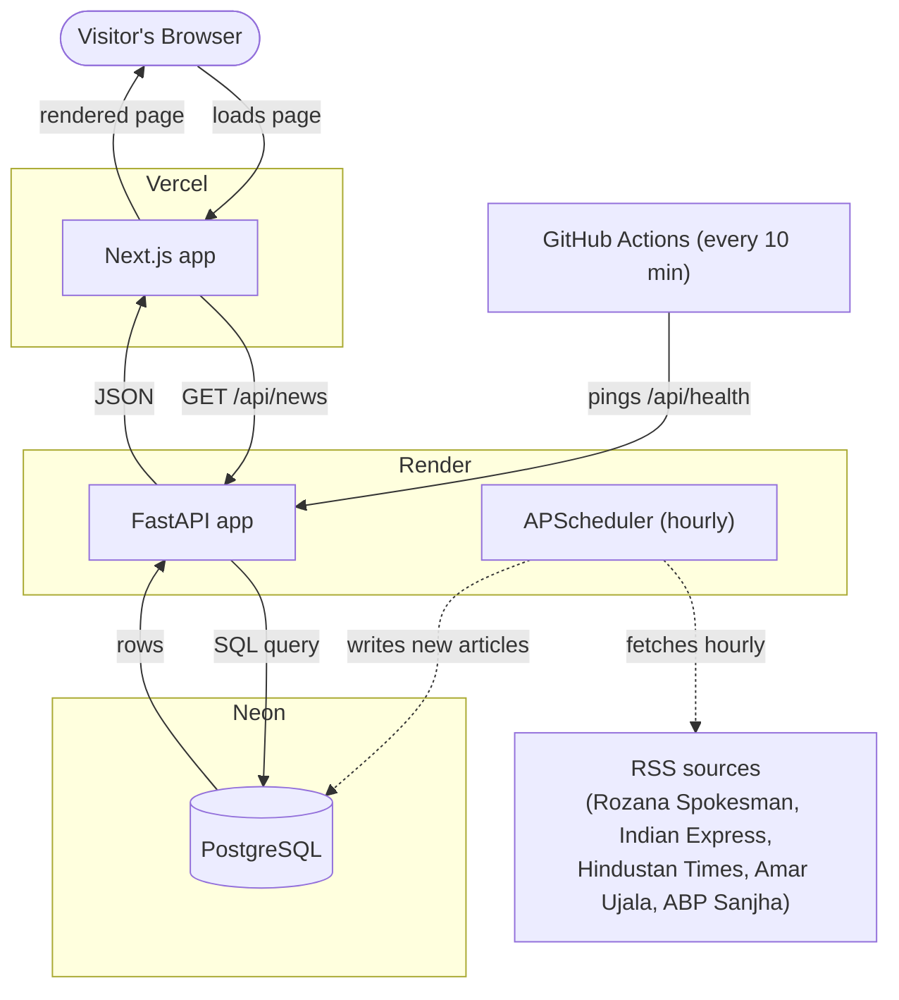

<p align="center">
  
</p>

# Abhijeet Tripathi's Punjab Pulse

News and events aggregator focused on Punjab, India. Aggregates real articles from RSS feeds across 5 sources, classifies them by category/district/language, and refreshes automatically every hour — with a community submissions page for local events.

**Live site**: [punjab-pulse.vercel.app](https://punjab-pulse.vercel.app) · **API**: [punjab-pulse-api.onrender.com](https://punjab-pulse-api.onrender.com)

## Tech Stack

| Layer | Technology | Hosting (free tier) |
|---|---|---|
| Frontend | Next.js 15 + TypeScript + Tailwind CSS | Vercel |
| Backend | Python + FastAPI | Render |
| Database | PostgreSQL | Neon |
| Scheduling | APScheduler (in-process, hourly) | — |
| Automation | GitHub Actions (keeps backend awake) | GitHub |

## Architecture



Three separate free services because each does one job well: Vercel serves the frontend fast globally, Render keeps the backend's hourly scheduler running continuously, and Neon stores data independent of either app's lifecycle. GitHub Actions pings the backend every 10 minutes so Render's free tier doesn't spin it down mid-schedule.

## Quick Start (local development)

Requires Python 3.12+ (not 3.14 — see note below), Node 20+, and a running PostgreSQL instance.

```bash
# 1. Clone and enter
git clone https://github.com/chinmayrozekar/punjab-pulse
cd punjab-pulse

# 2. Copy environment file
cp .env.example .env
# Edit .env to set DATABASE_URL and API keys

# 3. Backend
cd backend
python3 -m venv venv && source venv/bin/activate
pip install -r requirements.txt
uvicorn app.main:app --reload

# 4. Frontend (in a separate terminal)
cd frontend
npm install
npm run dev

# Frontend: http://localhost:3000
# Backend API: http://localhost:8000
# API Docs: http://localhost:8000/docs
```

> **Python version note**: `asyncpg` and `pydantic-core` don't ship prebuilt wheels for Python 3.14 yet and fail to compile from source. Use Python 3.12.

## Project Structure

```
├── frontend/              # Next.js 15 app
│   └── src/
│       ├── app/           # Pages (feed, search, events, sources, submit)
│       ├── components/    # Shared components (navbar, footer, news-card)
│       └── lib/           # API client, utilities
├── backend/               # FastAPI app
│   └── app/
│       ├── models/        # SQLAlchemy models
│       ├── routers/       # API routes (news, events, search)
│       ├── fetchers/      # RSS & GNews fetchers
│       ├── classify.py    # Rule-based category/district/language classifier
│       ├── schemas/       # Pydantic schemas
│       └── tasks/         # Ingestion + reclassification
├── render.yaml            # Render deployment config
├── .github/workflows/     # GitHub Actions (keep-alive cron)
└── .env.example           # Environment template
```

## API Endpoints

| Method | Path | Description |
|---|---|---|
| GET | /api/health | Health check |
| GET | /api/news | Paginated news feed (filter by category/district/language) |
| GET | /api/search?q= | Search news articles |
| GET | /api/events | Events calendar |
| POST | /api/events | Submit new event |
| POST | /api/ingest | Manually trigger ingestion (requires `X-Ingest-Secret` header) |

## Ethical Scraping

- Uses real RSS feeds, not HTML scraping
- Identifies with a descriptive User-Agent
- Public sources only

## Credits

Designed and developed by [Chinmay Rozekar](https://x.com/ChinmayRozekar), for [Abhijeet Tripathi](https://x.com/AbhTri_).

## License

MIT
